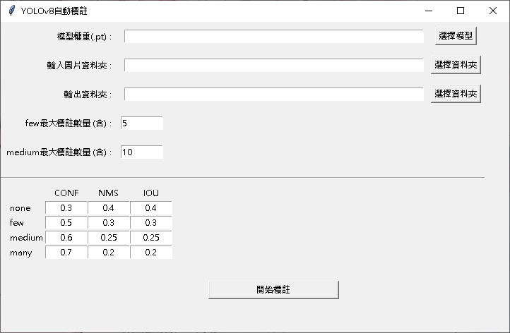
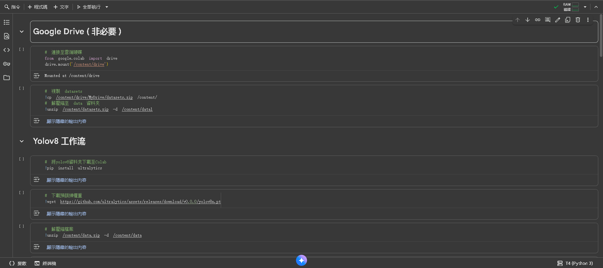
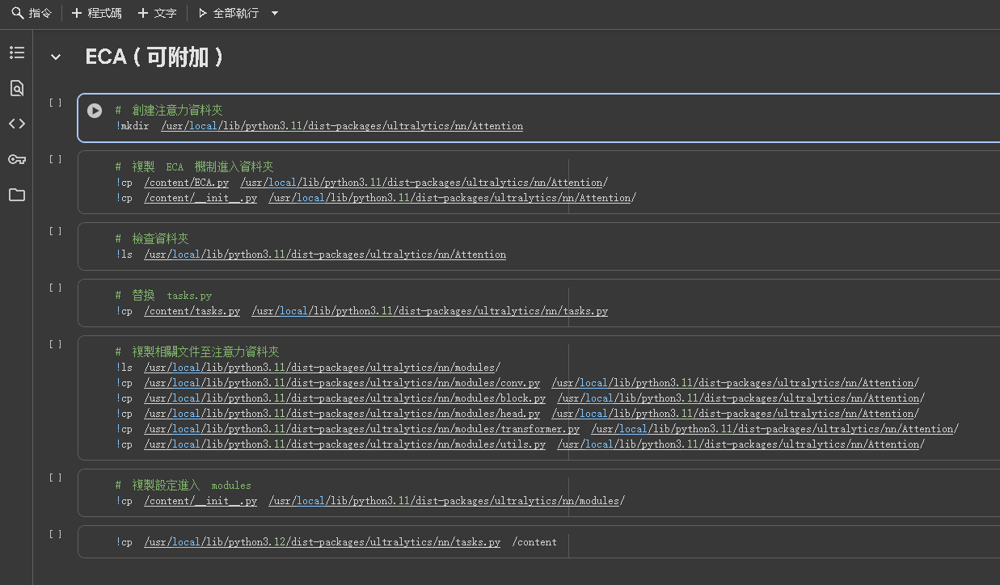

# Yolov8 自動標註 (Auto labeling)
此專案僅適用於 ultralytics 模型的自動標註

## 1. 自動標註使用介紹
### optain.py
為自動標註的運行代碼 須配合 UI.py 做使用

### UI.py
為自動標註的UI介面

在本地環境中使用以下命令即可啟動
```
python UI.py
```
啟動後如下圖
<p align="left">
  
</p>
可自定義 Conf, NMS, IoU 等參數

並可根據圖片中的標籤數量 使用對應的參數標註

## 2. Google Colab 訓練工作流介紹

### yolov8 v1.3.ipynb
為 Yolov8 的 Google Colab 工作流檔案

將其導入 Colab 中即可使用

導入後 檔案如下
<p align="left">
  
</p>

### CBAM / ECA 資料夾
可選用或添加的注意力機制

將對應資料夾中的檔案上傳至Colab

並照著工作流替換檔案即可加裝

以 ECA 為例
<p align="left">
  
</p>
將 ECA 資料夾中的檔案上傳後

照著工作流中的流程 由上往下執行 即可成功安裝
